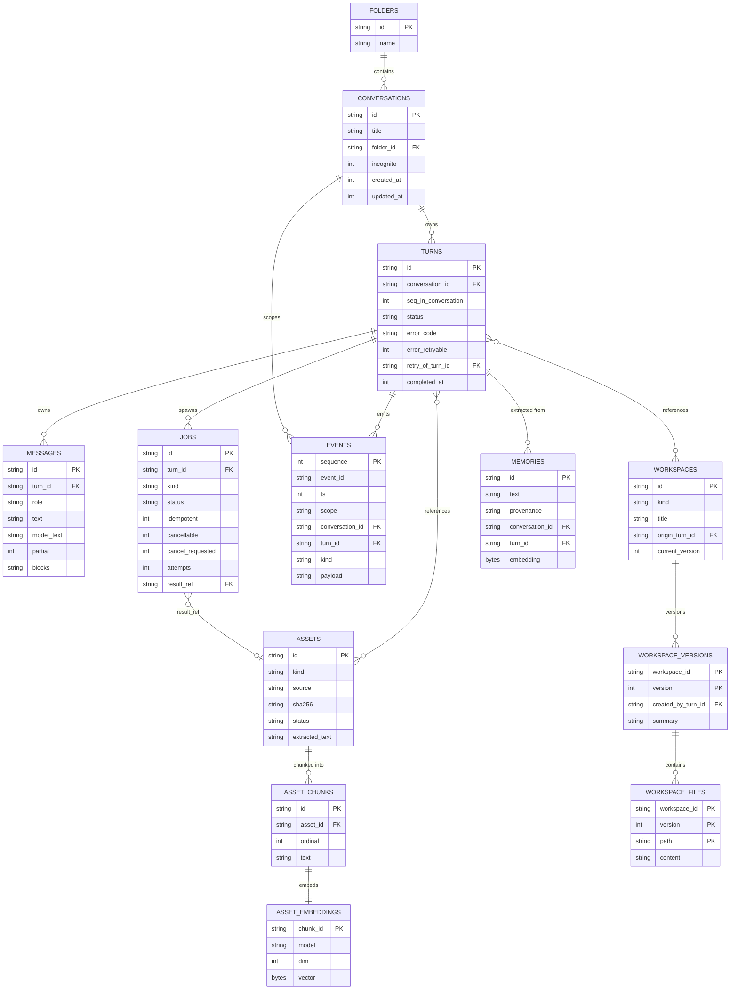

# Primnox V2 — Entity Relationships

Companion to [primnox_v2.sql](primnox_v2.sql) and
[CONVERSATION_RUNTIME_SPEC.md](../CONVERSATION_RUNTIME_SPEC.md).

## The ownership rule

The whole shape follows from one rule (CRS §2.1):

```
Conversation ──owns──► Turn ──owns──► Message, Job
Conversation ──X──── Workspace          (references only)
Conversation ──X──── Asset              (references only)
```

Turns cascade with their conversation. Workspaces and assets **do not** — they
outlive it. That single decision is why `origin_turn_id` is `ON DELETE SET
NULL` and `turn_assets` / `turn_workspaces` are join tables rather than
foreign keys on the objects themselves.

## Diagram



## DSL source

```
conversations [icon: message-circle] {
  id string pk
  title string
  folderId string
  incognito boolean
  createdAt timestamp
  updatedAt timestamp
}

turns [icon: repeat] {
  id string pk
  conversationId string
  seqInConversation number
  status string
  errorCode string
  errorRetryable boolean
  retryOfTurnId string
  createdAt timestamp
  completedAt timestamp
}

messages [icon: file-text] {
  id string pk
  turnId string
  role string
  text string
  modelText string
  partial boolean
  blocks json
}

jobs [icon: cpu] {
  id string pk
  turnId string
  kind string
  status string
  idempotent boolean
  cancellable boolean
  cancelRequested boolean
  attempts number
  resultRef string
}

events [icon: activity] {
  sequence number pk
  eventId string
  ts timestamp
  scope string
  conversationId string
  turnId string
  kind string
  payload json
}

assets [icon: paperclip] {
  id string pk
  kind string
  source string
  sha256 string
  status string
  extractedText string
}

assetChunks [icon: layers] {
  id string pk
  assetId string
  ordinal number
  text string
}

assetEmbeddings [icon: box] {
  chunkId string pk
  model string
  dim number
  vector blob
}

workspaces [icon: home] {
  id string pk
  kind string
  title string
  originTurnId string
  currentVersion number
}

workspaceVersions [icon: git-branch] {
  workspaceId string pk
  version number pk
  createdByTurnId string
  summary string
}

workspaceFiles [icon: file] {
  workspaceId string pk
  version number pk
  path string pk
  content string
}

memories [icon: database] {
  id string pk
  text string
  provenance string
  conversationId string
  turnId string
}

folders [icon: folder] {
  id string pk
  name string
}

turnAssets [icon: link] {
  turnId string pk
  assetId string pk
}

turnWorkspaces [icon: link] {
  turnId string pk
  workspaceId string pk
}

conversations.folderId > folders.id
turns.conversationId > conversations.id
turns.retryOfTurnId > turns.id
messages.turnId > turns.id
jobs.turnId > turns.id
jobs.resultRef > assets.id
events.conversationId > conversations.id
events.turnId > turns.id
assetChunks.assetId > assets.id
assetEmbeddings.chunkId > assetChunks.id
workspaces.originTurnId > turns.id
workspaceVersions.workspaceId > workspaces.id
workspaceFiles.workspaceId > workspaceVersions.workspaceId
memories.conversationId > conversations.id
memories.turnId > turns.id
turnAssets.turnId > turns.id
turnAssets.assetId > assets.id
turnWorkspaces.turnId > turns.id
turnWorkspaces.workspaceId > workspaces.id
```

## Delete behaviour

Worth reading as a table, because it is where the ownership rule becomes real:

| Parent deleted | Child | Behaviour | Why |
|---|---|---|---|
| Conversation | Turns | `CASCADE` | turns have no meaning without their conversation |
| Conversation | Events | `CASCADE` | recovery log, not history (CRS §3.3) |
| Conversation | Memories | `SET NULL` | a fact learned about the user outlives the chat |
| Turn | Messages | `CASCADE` | owned |
| Turn | Jobs | `CASCADE` | owned |
| Turn | Workspaces | `SET NULL` | **the artifact survives** (CRS §2.5) |
| Turn | Assets | join row only | **the file survives** (CRS §2.6) |
| Folder | Conversations | `SET NULL` | deleting a folder must not delete chats |
| Asset | Chunks / embeddings | `CASCADE` | derived data |
| Workspace | Versions / files | `CASCADE` | owned |

## Verification

`docs/schema/primnox_v2.sql` is executable and its constraints are tested. The
checks that pass against a fresh database:

- `PRAGMA foreign_key_check` — clean
- turn creation and completion commit atomically with their events
- the global sequence stays gapless across a rolled-back transaction (CRS §3.1.3)
- unknown turn status is rejected (CRS §5.1)
- a terminal turn without `completed_at` is rejected (CRS §5.2)
- a second assistant message on one turn is rejected (CRS §2.2)
- a `conversation`-scoped event with a null `conversation_id` is rejected (CRS §3.2)
- automatic retry on a non-idempotent job is rejected (CRS §6.2.3)
- duplicate `sha256` assets are rejected (CRS §2.6)
- deleting a conversation cascades its turns but leaves the workspace and its
  files intact, with `origin_turn_id` nulled (CRS §2.5)
